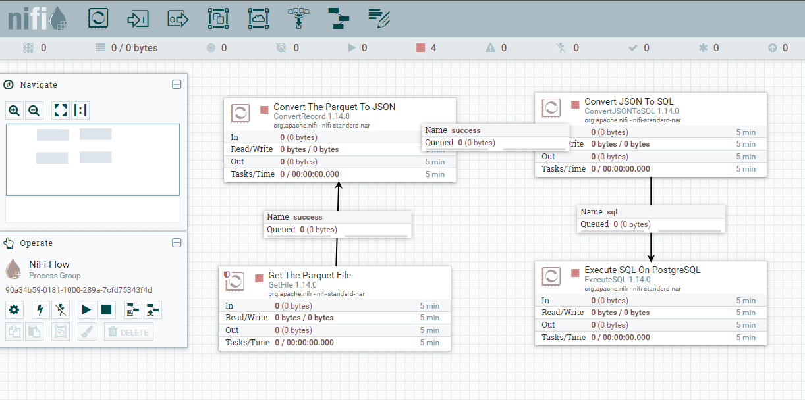

# nifi-starter
Docker image containing all the bells and whistles to explore NiFi without any configuration

## Getting Started

### Sample dataflow to load data from a Parquet file into a PostgreSQL database 

Now let us run a sample flow to read a Parquet file and load the data into a PostgreSQL database on our Windows machine
- The sample parquet data file is available under *examples/load_parquet_postgres/userdata1.parquet* in this repository
- The sample flow is available under *examples/load_parquet_postgres/dataflow.json*
- The sample uery to create the loading table in PostgreSQL can be found at *examples/load_parquet_postgres/userdata.sql*

#### Steps:
1. Spin-up a PostgreSQL container using the command below
```
docker pull postgres
docker run --name postgres-db -p 5432:5432 -e POSTGRES_PASSWORD=password -d postgres
```
2. Login to the database using any client like DBeaver and create a table using the query from above *(userdata.sql)*
3. Spin-up a NiFi Starter container 
```
docker pull sudeephazra/nifi-starter
mkdir c:\temp
docker run --name nifi-custom -v c:/temp:/var/tmp -p 8443:8443 -d nifi-starter:<tag>
```
Check the container logs for the login username and password. It will be something like the below
```
Generated Username [a41c5ea8-255c-447b-93f6-1f5d9f564ae7]
Generated Password [HjAGLfwkjVE4+2+cpv5orIkP2Qvof8yh]
```
4. Create a new network
```
docker network create --attachable nifi-starter-network
```
5. Add the NiFi and PostgreSQL containers to the same network
```
docker network connect nifi-starter-network nifi-custom
docker network connect nifi-starter-network postgres-db
```
6. Place the parquet file in C:\temp
7. Go to *https://localhost:8443/nifi*
8. Create the dataflow as per the config file *(dataflow.json)* and run the flow

9.  Check the database for data to be loaded into the *public.userdata* table and the original file being deleted after being read

### To build the Image
Clone the project
```
git clone https://github.com/sudeephazra/nifi-starter.git .
```
Download all the necessary library files 
Build the image
```
docker build -t nifi-starter:<tag> .
```
Run the image
```
docker run --name nifi-custom -p 8443:8443 -d nifi-starter:<tag>
```
Run the image from Windows and map a location on the host to the container
```
docker run --name nifi-custom -v c:/temp:/var/tmp -p 8443:8443 -d nifi-starter:<tag>
```
This will map the folder C:\temp to /var/tmp of the container. To validate this, 
- Place a file in C:\temp  
- Run the following commands to check the same file exists in /var/tmp of the container
```
docker exec -it nifi-custom /bin/bash
cd /var/tmp
ls -l
```

## Custom Processors Added
- Greenplum

## Supported Databases Out-Of-The-Box

### MySQL
**Classname**: com.mysql.jdbc.Driver
**Connection String**: jdbc:mysql://server-name:server-port/database-name
**Reference**: https://docs.oracle.com/cd/E19509-01/820-3497/agqju/index.html

### PostgreSQL
**Classname**: org.postgresql.Driver
**Connection String**: jdbc:postgresql://server-name:server-port/database-name
**Reference**: https://docs.oracle.com/cd/E19509-01/820-3497/agqka/index.html

### SQL Server
**Classname**: com.microsoft.sqlserver.jdbc.SQLServerDriver
**Connection String**: jdbc:sqlserver://server-name:server-port;databaseName=database-name
**Reference**: https://docs.microsoft.com/en-us/sql/connect/jdbc/microsoft-jdbc-driver-for-sql-server

### Oracle
**Classname**: com.microsoft.sqlserver.jdbc.SQLServerDriver
**Connection String**: jdbc:sqlserver://server-name:server-port;databaseName=database-name
**Reference**: https://docs.microsoft.com/en-us/sql/connect/jdbc/microsoft-jdbc-driver-for-sql-server

### SQLite
**Classname**: org.sqlite.JDBC
**Connection String**: jdbc:sqlite:database-file
**Reference**: https://www.tutorialspoint.com/sqlite/sqlite_java.htm

### Apache Derby
#### Network
**Classname**: org.apache.derby.jdbc.ClientDriver
**Connection String**: jdbc:derby://server-name:server-port/database-name
**Reference**: https://db.apache.org/derby/docs/10.4/devguide/cdevdvlp40653.html
#### Embedded
**Classname**: org.apache.derby.jdbc.EmbeddedDriver
**Connection String**: jdbc:derby:database-file
**Reference**: https://db.apache.org/derby/docs/10.4/devguide/cdevdvlp40653.html


### Firebird
**Classname**: org.firebirdsql.jdbc.FBDriver
**Connection String**: jdbc:firebirdsql://server-name:server-port/database-file
**Reference**: https://firebirdsql.github.io/jaybird-manual/jaybird_manual.html

### MariaDB
**Classname**: org.mariadb.jdbc.Driver
**Connection String**: jdbc:mariadb://server-name:server-port/database-name
**Reference**: https://mariadb.com/kb/en/about-mariadb-connector-j/

### Cockroach DB
**Classname**: org.postgresql.Driver
**Connection String**: jdbc:postgresql://server-name:server-port/database-name
**Reference**: https://www.cockroachlabs.com/docs/v21.2/install-client-drivers.html?filters=java

### Yugabyte
**Classname**: java.sql.DriverManager
**Connection String**: jdbc:yugabytedb://server-name:server-port/database-name
**Reference**: https://docs.yugabyte.com/preview/drivers-orms/java/yugabyte-jdbc/

### Greenplum
**Classname**: org.postgresql.Driver
**Connection String**: jdbc:postgresql://server-name:server-port/database-name
**Reference**: https://greenplum.docs.pivotal.io/pxf/6-0/using/jdbc_cfg.html

CHANGELOG:

**v0.0.1**
- Added supporting libraries for DB connection to embedded databases like SQLite, and Apache Derby
- Added supporting libraries for MySQL, PostgreSQL, SQL Server, Oracle, MariaDB, CockroachDB, Firebird, and Yugabyte
- Added Greenplum processor


